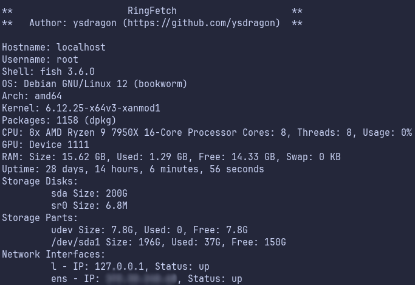
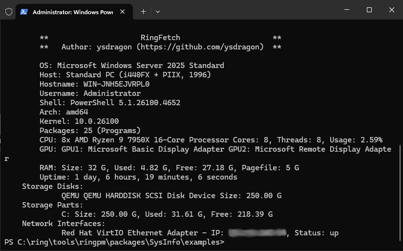

<div align="center">

# SysInfo

A comprehensive system information retrieval package for [Ring](https://ring-lang.net/) programming language

[](https://ring-lang.net/)


</div>

## Overview

SysInfo is a powerful Ring package that provides easy access to essential system information across different operating systems.

## Features

### Core System Info
- System hostname and username
- OS name and kernel version
- CPU model, cores, and usage metrics
- RAM capacity and usage statistics
- GPU detection and details
- Storage devices and partition info
- System uptime tracking
- Virtual machine detection

### Environment Details
- Shell identification and version
- Terminal emulator detection
- Package count and manager info
- System architecture detection

### Cross-Platform Support
- Linux/Unix/Windows support


## Installation

### Using Ring Package Manager (`ringpm`)

#### From the RingPM Registry
```bash
# Refresh the registry first
ringpm refresh

# Install the package
ringpm install SysInfo
```

#### From This Repository
```bash
ringpm install SysInfo from ysdragon
```

To update to the latest version:
```bash
ringpm update SysInfo
```

## Usage

```ring
load "SysInfo.ring"

// Create a new SysInfo instance
sys = new SysInfo

// Get basic system information
? "OS: " + sys.os()[:name]
? "Hostname: " + sys.hostname()
? "CPU: " + sys.cpu()[:model]
? "Total RAM: " + sys.ram()[:size] + " GB"
```

## Example
Check out ***[RingFetch](https://github.com/ysdragon/SysInfo/tree/main/examples)***, a complete system information display tool built with SysInfo.

|*RingFetch on a Linux VM*                                                                                   | *RingFetch on a Windows VM*                                                                           |
|-----------------------------------------------------------------------------------|----------------------------------------------------------------------------|
|                                        |                                 |
                                                      

## Supported Operating Systems
### Fully Tested
- **Linux**
    - Debian
    - Ubuntu
    - Void Linux
    - Alpine Linux
    - CentOS
    - Rocky Linux
    - Fedora
    - AlmaLinux
    - Slackware Linux
    - Kali Linux
    - openSUSE
    - Gentoo Linux
    - Arch Linux
    - Devuan Linux
    - Chimera Linux
- **Windows**
  - Windows 10
  - Windows 11
  - Windows Server 2019
  - Windows Server 2022

## Contributing
Public contributions are welcome!  
You can create a [new issue](https://github.com/ysdragon/SysInfo/issues/new) for bugs, or feel free to open a [pull request](https://github.com/ysdragon/SysInfo/pulls) for any and all your changes or work-in-progress features.

## License
This project is open-source and available under the MIT License. See the [LICENSE](https://github.com/ysdragon/SysInfo/blob/main/LICENSE) file for more details.
